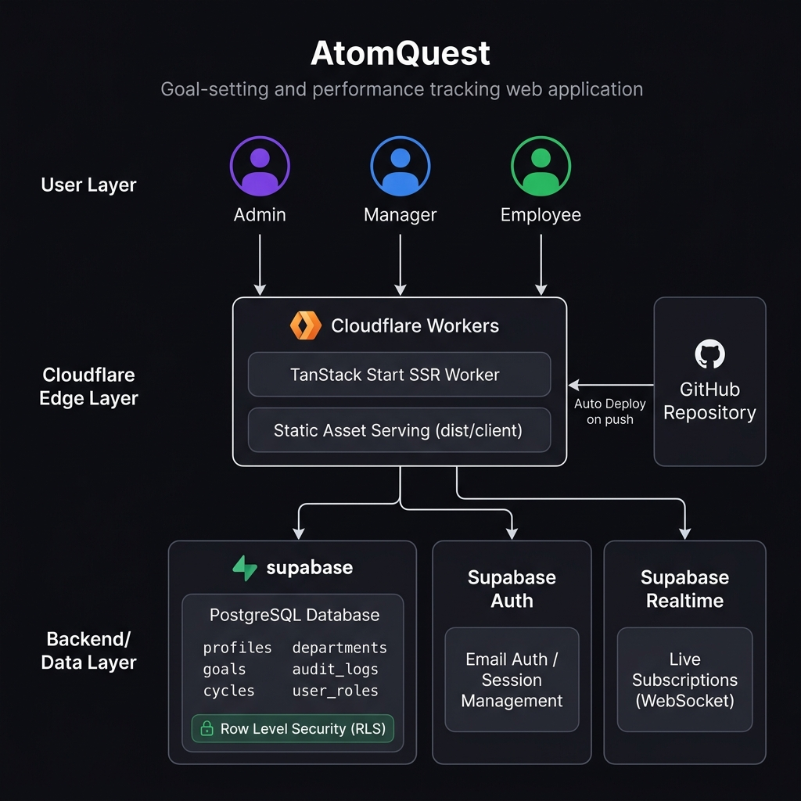

# AtomQuest — Align Goals. Track Progress.

> An AI-ready Goal Setting & Performance Tracking Portal for modern enterprises, built for Atomberg.

---

## 🌐 Live Links

| Resource | URL |
|----------|-----|
| **Production App** | [https://atomberg-goals.bhadauriyaankushsingh3.workers.dev](https://atomberg-goals.bhadauriyaankushsingh3.workers.dev) |
| **Source Code** | [https://github.com/iankushsingh/atomberg-goals](https://github.com/iankushsingh/atomberg-goals) |

---

## 🔑 Demo Credentials

Use these accounts to explore all three roles in the application:

| Role | Email | Password |
|------|-------|----------|
| **Admin** | `admin@atomberg.com` | `Admin@123` |
| **Manager** | `manager@atomberg.com` | `Manager@123` |
| **Employee** | `employee@atomberg.com` | `Employee@123` |

> **Note:** New users who sign up via the registration page are automatically assigned the **Employee** role. An Admin can promote any employee to Manager from the Users Management page.

---

## 📖 About AtomQuest

AtomQuest is a full-stack, real-time goal management platform designed for enterprise-scale performance tracking. It enables organizations to define, track, and report on OKR-style goals across all levels — from individual contributors to company-wide initiatives.

### Key Features

#### 🎯 Goal Management
- Create, update, and track goals with **target vs actual** values, unit of measure, and weightage
- Mark goals across multiple thrust areas (Financial, Customer, Process, People, etc.)
- Full approval workflow: Draft → Pending → Approved / Rejected
- Quarterly check-in submissions with progress updates

#### 👥 Role-Based Access Control
- **Admin** — Full control: manage users, departments, goal cycles, view all dashboards, run reports
- **Manager** — Approve/reject team goals, view team analytics, manage their department's goals
- **Employee** — Submit goals, update progress, view personal dashboard

#### 📊 Analytics & Reporting
- Real-time achievement heatmaps by thrust area
- Target vs Actual bar charts per department
- Live KPI cards: org completion %, pending escalations, active cycles
- Export reports as CSV/Excel for any report type

#### 🔔 Escalations
- Automatic escalation generation for goals marked "At Risk" or "Delayed"
- Escalation levels: Employee → Manager → HR (based on days overdue)

#### 🗓 Goal Cycles
- Admin can create named goal cycles with start/end dates
- Cycles are marked Active or Closed
- All goals are scoped to an active cycle

#### 🧾 Audit Logs
- Every action (goal submitted, updated, approved) is logged in real-time
- Visible to Admins from the Audit Trail page

#### 🔐 Security
- Supabase Row Level Security (RLS) on all tables
- Role-based navigation enforced server-side
- Auth sessions with auto-refresh tokens

---

## 🏛 Architecture



### Stack Overview

```
Frontend:   TanStack Start (React 19, SSR) + TailwindCSS v4 + Radix UI
Backend:    Cloudflare Workers (Edge SSR via @cloudflare/vite-plugin)
Database:   Supabase (PostgreSQL + Auth + Realtime subscriptions)
Charts:     Recharts
Build:      Vite 7 + TypeScript
CI/CD:      GitHub → Cloudflare Workers (auto-deploy on push to main)
```

### Layer Breakdown

```
┌──────────────────────────────────────────────────────────────┐
│                        USER LAYER                            │
│           Admin         Manager         Employee             │
└────────────────────────────┬─────────────────────────────────┘
                             │  HTTPS
┌────────────────────────────▼─────────────────────────────────┐
│               CLOUDFLARE EDGE LAYER                          │
│                                                              │
│  ┌────────────────────────────────────────────────────────┐  │
│  │          TanStack Start SSR Worker                     │  │
│  │  - Server-side renders React routes                    │  │
│  │  - Serves pre-built static assets (dist/client)        │  │
│  │  - Handles API routes & auth redirects                 │  │
│  └────────────────────────────────────────────────────────┘  │
│                                                              │
│  ← Auto-deployed from GitHub on every push to `main`        │
└────────────────────────────┬─────────────────────────────────┘
                             │ Supabase JS SDK
┌────────────────────────────▼─────────────────────────────────┐
│                 SUPABASE BACKEND LAYER                        │
│                                                              │
│  ┌───────────────────┐  ┌──────────────┐  ┌──────────────┐  │
│  │  PostgreSQL DB    │  │  Auth        │  │  Realtime    │  │
│  │                   │  │              │  │              │  │
│  │  • profiles       │  │  Email/Pass  │  │  WebSocket   │  │
│  │  • goals          │  │  Sessions    │  │  Live sync   │  │
│  │  • cycles         │  │  JWT tokens  │  │  goals,      │  │
│  │  • departments    │  │              │  │  profiles,   │  │
│  │  • audit_logs     │  │              │  │  audit_logs  │  │
│  │  • user_roles     │  │              │  │              │  │
│  │                   │  │              │  │              │  │
│  │  [RLS Enforced]   │  │              │  │              │  │
│  └───────────────────┘  └──────────────┘  └──────────────┘  │
└──────────────────────────────────────────────────────────────┘
```

---

## 🗂 Database Schema

| Table | Purpose |
|-------|---------|
| `profiles` | User profiles: name, employee ID, department, avatar |
| `goals` | All goal records with targets, actuals, status, and approval state |
| `cycles` | Named goal windows (e.g. FY26 H1) with start/end dates |
| `departments` | Master list of departments (Engineering, Sales, HR, etc.) |
| `audit_logs` | Immutable log of all create/update actions with actor + timestamp |
| `user_roles` | Maps user IDs to roles: `admin`, `manager`, `employee` |

---

## 🚀 Local Development

### Prerequisites
- Node.js 20+
- npm 10+

### Setup

```bash
# Clone the repository
git clone https://github.com/iankushsingh/atomberg-goals.git
cd atomberg-goals

# Install dependencies
npm install

# Create a .env file (already present in repo for development)
# The Supabase keys are included in wrangler.jsonc vars

# Start the development server
npm run dev
```

Open [http://localhost:8080](http://localhost:8080) in your browser.

### Build for Production

```bash
npm run build
```

This builds both the client bundle (`dist/client/`) and the Cloudflare Worker (`dist/server/`) via the `@cloudflare/vite-plugin`.

---

## ⚙️ CI/CD Pipeline

Every push to the `main` branch automatically:

1. **GitHub** triggers a new Cloudflare Workers build
2. Cloudflare installs dependencies (`npm ci`)
3. Runs `npm run build` (Vite builds client + SSR worker)
4. Deploys the Worker to `atomberg-goals.bhadauriyaankushsingh3.workers.dev`

No manual deploy steps needed.

---

## 📁 Project Structure

```
atomberg-goals/
├── src/
│   ├── components/       # Shared UI components (AppLayout, Kpi, ChartCard...)
│   ├── integrations/
│   │   └── supabase/     # Auto-generated Supabase client & types
│   ├── lib/
│   │   └── live-data.ts  # All real-time data hooks (useLiveGoals, useLiveProfiles...)
│   ├── pages/            # Role-based dashboards (Admin, Manager, Employee)
│   ├── routes/           # TanStack Router file-based routes
│   │   └── _app/         # Protected routes (goals, cycles, reports, audit...)
│   └── server.ts         # Cloudflare Worker entry point
├── supabase/
│   ├── seed_departments.sql  # Seed the 12 departments
│   └── make_admin.sql        # Promote a user to admin by UID
├── docs/
│   └── architecture.png  # Architecture diagram
├── wrangler.jsonc        # Cloudflare Workers configuration
└── vite.config.ts        # Vite + Cloudflare + TanStack Start build config
```

---

## 👤 User Role Guide

| Action | Employee | Manager | Admin |
|--------|----------|---------|-------|
| Create own goals | ✅ | ✅ | ✅ |
| Submit quarterly check-ins | ✅ | ✅ | ✅ |
| Update profile & name | ✅ | ✅ | ✅ |
| Approve / reject team goals | ❌ | ✅ | ✅ |
| View team analytics | ❌ | ✅ | ✅ |
| Manage users & roles | ❌ | ❌ | ✅ |
| Create goal cycles | ❌ | ❌ | ✅ |
| Manage departments | ❌ | ❌ | ✅ |
| View audit logs | ❌ | ❌ | ✅ |
| Export reports | ❌ | ❌ | ✅ |
| View escalations | ❌ | ❌ | ✅ |

> **Default Role:** All new sign-ups are automatically assigned the **Employee** role. Admin must manually promote users to Manager via the Users page.

---

## 🛠 Seeding Departments

Run this SQL in your Supabase SQL Editor to seed the department list:

```sql
-- supabase/seed_departments.sql
INSERT INTO public.departments (name) VALUES 
  ('Engineering'), ('Sales'), ('Marketing'), ('Operations'),
  ('Product'), ('HR'), ('Finance'), ('Legal'),
  ('Design'), ('Data'), ('Support'), ('Security')
ON CONFLICT (name) DO NOTHING;
```

---

## 📜 License

Internal project — Atomberg Technologies Pvt. Ltd. All rights reserved.
